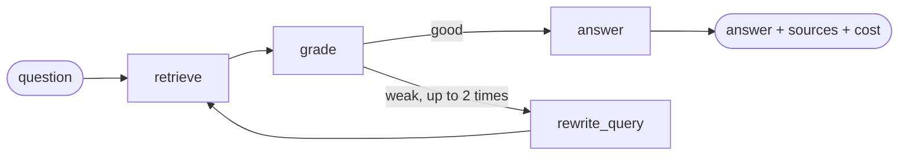

# He-Net Answers

Ask a question about He-Net and get an answer taken from the company's website, with links to
the pages it came from.

He-Net sells internet, TV and mobile plans in Bahia, Brazil. This project reads henet.com.br,
indexes the text and answers questions with a small agent. The agent searches, checks whether
what it found actually answers the question, tries a better query when it does not, and then
writes the answer citing its sources. You can use it through an HTTP API with streaming, through
an MCP server, or through a simple web page.

I wrote it for support teams that want a fast answer they can verify, and for anyone who wants a
compact example of a retrieval agent on top of a WordPress site.

## How it works



`retrieve` runs a hybrid search: vectors in Chroma plus BM25 over the same chunks, merged with
reciprocal rank fusion. `grade` asks the model if the excerpts answer the question. If not,
`rewrite_query` produces a better query and the graph goes back to `retrieve`, at most twice.
`answer` gives the model the excerpts and the `search_knowledge_base` tool, runs the tool loop
until the model stops asking for it, and streams the text. Every excerpt the model saw becomes a
source. Tokens and cost accumulate in the graph state, and checkpoints go to SQLite.

The model provider is one interface with two implementations, OpenAI (default) and Anthropic.
Embeddings always come from OpenAI.

| Folder | Contents |
|---|---|
| `henet_kb/ingest/` | sources (sitemap crawler, WordPress REST), HTML cleaning, chunking |
| `henet_kb/index/` | Chroma, BM25, fusion, embeddings |
| `henet_kb/llm/` | provider interface, the two adapters, price table |
| `henet_kb/tools/` | the search tool and the tool use loop |
| `henet_kb/agent/` | the LangGraph graph and the service that streams it |
| `henet_kb/api/` | FastAPI app and SSE helpers |
| `henet_kb/mcp_server.py` | MCP server, stdio and HTTP |
| `evals/` | ten questions with expected URLs and the runner |
| `frontend/` | Next.js page |

## Running it

You need Python 3.12, Node 22 and an OpenAI API key.

```bash
cp .env.example .env            # set OPENAI_API_KEY
python3.12 -m venv .venv && . .venv/bin/activate && pip install -e '.[dev]'
henet-kb ingest --source sitemap --reset && uvicorn henet_kb.api.app:app --reload
```

In another terminal:

```bash
cd frontend && npm install && NEXT_PUBLIC_API_URL=http://localhost:8000 npm run dev
```

Other things you can do:

```bash
henet-kb search "planos de fibra"                       # search from the terminal
henet-kb ingest --source wordpress --dry-run            # see what the REST connector would index
curl -N -X POST localhost:8000/ask/stream -H 'content-type: application/json' \
     -d '{"question": "Quais planos de TV existem?"}'   # raw SSE
pytest -q && ruff check .                               # 63 tests, no network needed
```

### API

| Route | What it does |
|---|---|
| `POST /ask` | answer, sources, query, grade, rewrites, tokens, cost and thread_id as JSON |
| `POST /ask/stream` | the same as server sent events: `start`, `status`, `delta`, `sources`, `done`, `error` |
| `GET /health` | provider, model and number of indexed chunks |
| `POST /ingest` | crawl a source again, protected by `Authorization: Bearer $INGEST_TOKEN` |

`status` events carry a `stage`: `searching`, `grading`, `rewriting` or `answering`.

### Docker

`docker compose up` starts the API, a Chroma server and a local WordPress with MariaDB. The
WordPress is there to test the REST connector against something you control. Install it once
with the WordPress CLI (`wp core install`, see the compose file for the database settings) and
point the connector at it:

```bash
henet-kb ingest --source wordpress --site-url http://localhost:8080
```

## MCP

The MCP server exposes `search_knowledge_base(query, top_k)` and `ask(question, thread_id)`.
Any MCP client can use it. Over stdio:

```json
{
  "mcpServers": {
    "henet-kb": {
      "command": "/path/to/.venv/bin/henet-kb-mcp",
      "args": ["--transport", "stdio"],
      "cwd": "/path/to/repository"
    }
  }
}
```

Over HTTP, run `henet-kb-mcp --transport http --port 8765` and connect to
`http://127.0.0.1:8765/mcp`. Settings are read from the `.env` in the working directory.

## Evaluation

`evals/questions.jsonl` has ten questions, each with the page that answers it.
`python -m evals.run` asks all of them and reports how often the expected page is among the
cited sources. Results also go to `evals/results.json`.

Latest run: pending. The table printed by the script goes here.

## Why these choices

Chroma replaced the pandas CSV from the first version because I needed persistence, deletion by
URL when a page is crawled again, and an HTTP mode for Docker. If Postgres were already around I
would use pgvector; only the `HybridIndex` class would change.

Hybrid search because questions about a provider are full of exact words: plan names, speeds,
cities, "WhatsApp". Vectors alone miss those, BM25 alone misses paraphrases. Rank fusion is cheap
and needs no tuning.

Two providers because tool calling and streaming look different in each SDK, and I wanted the
rest of the code to see only `Message`, `ToolCall` and `Usage`. Switching is one variable.

Grade and rewrite live in the graph so there is always at least one retrieval and a hard limit on
retries. Search is also a tool so the model can fetch more when the first pass was partial. The
tool loop is written out by hand, and a failing tool goes back to the model as an error result.

SSE instead of WebSockets because the traffic only goes one way, it works with plain `fetch`, and
the event names double as the UI state.

## From v1 to v2

The first version (November 2024, tag `v1-2024`) was one notebook: links scraped from the home
page with Selenium, text dumped with `get_text()` including menus and cookie banners, chunks
split on ". ", embeddings in a CSV, cosine similarity in pandas, and an answer from
`gpt-3.5-turbo` without sources. The URL of each chunk was lost along the way.

The second version is a package with tests. It follows the sitemap (215 URLs instead of 16),
reads the WordPress REST API as well, keeps `url`, `title`, `section` and `chunk_index` on every
chunk, searches both ways, answers through the graph with tool use and streaming, always cites
sources, and is reachable by HTTP, SSE, MCP and the web page. Keys only come from environment
variables. The notebook and the scraped files were removed from this branch and stay under the
tag.

## Next

Google Workspace as a source, behind the same `Source` interface. A webhook on WordPress publish
that indexes only the changed page. Figma is out of scope; the base covers published text only.
