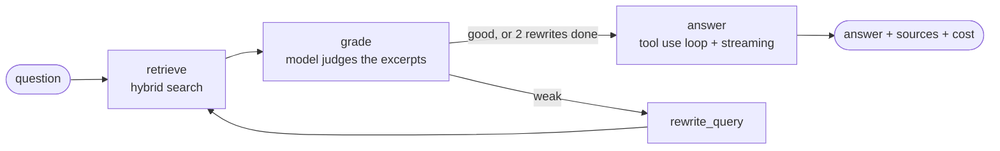

# He-Net Answers

Ask a question about He-Net and get an answer taken from the company's website, with links to
the pages it came from.

He-Net is an internet, TV and mobile provider in Bahia, Brazil. This project crawls
henet.com.br, indexes the text, and answers questions through a small agent that searches, checks
what it found, tries a better query when the first one fails, and writes an answer with sources.
It runs as a streaming HTTP API, as an MCP server for Claude Desktop and Claude Code, and as a web
page.

It is useful for support teams that want a quick answer grounded in the published pages, for
anyone building assistants on top of a WordPress site, and as a compact, tested reference for
retrieval agents with tool use and streaming.

## How it works



1. `retrieve` runs the same `search_knowledge_base` tool the model can call later. Vector results
   from Chroma and BM25 results are fused with reciprocal rank fusion.
2. `grade` asks the model whether the excerpts answer the question. A weak grade sends the graph
   to `rewrite_query`, at most twice, then back to `retrieve`.
3. `answer` runs an explicit tool use loop. The model gets the excerpts, may call
   `search_knowledge_base` again, tool errors go back to it as error results, and text is streamed
   as it is produced. Sources are the unique URLs of every excerpt the model saw.
4. State carries the accumulated tokens and cost. Checkpoints go to SQLite, keyed by `thread_id`.

The model provider sits behind one interface with two adapters, OpenAI (default) and Anthropic.
Embeddings always use OpenAI.

| Path | What lives there |
|---|---|
| `henet_kb/ingest/` | `Source` interface, `SitemapCrawler`, `WordPressRestSource`, HTML cleaning, chunking |
| `henet_kb/index/` | Chroma collection, BM25, fusion, OpenAI embeddings |
| `henet_kb/llm/` | Provider interface, `OpenAIProvider`, `AnthropicProvider`, price table |
| `henet_kb/tools/` | `search_knowledge_base` schema and the tool use loop |
| `henet_kb/agent/` | LangGraph graph, prompts, `AgentService` (turns the graph into events) |
| `henet_kb/api/` | FastAPI app, SSE encoder and parser |
| `henet_kb/mcp_server.py` | FastMCP server (stdio and HTTP) |
| `evals/` | Ten questions with expected URLs and the runner |
| `frontend/` | Next.js client |

## Running it

Requirements: Python 3.12, Node 22 and an OpenAI API key. Docker is optional.

```bash
cp .env.example .env            # then set OPENAI_API_KEY
python3.12 -m venv .venv && . .venv/bin/activate && pip install -e '.[dev]'
henet-kb ingest --source sitemap --reset && uvicorn henet_kb.api.app:app --reload
```

Then, in another terminal:

```bash
cd frontend && npm install && NEXT_PUBLIC_API_URL=http://localhost:8000 npm run dev
```

Useful commands:

```bash
henet-kb search "planos de fibra"                        # hybrid search from the terminal
henet-kb ingest --source wordpress --dry-run             # list what the REST connector would index
henet-kb ingest --source wordpress --site-url http://localhost:8080   # index a local WordPress
curl -N -X POST localhost:8000/ask/stream -H 'content-type: application/json' \
     -d '{"question": "Quais planos de TV existem?"}'    # SSE: start, status, delta, sources, done
pytest -q && ruff check .                                # 63 tests, all offline
```

### API

| Method and path | Purpose |
|---|---|
| `POST /ask` | Full answer as JSON: answer, sources, query, grade, rewrites, tokens, cost, thread_id |
| `POST /ask/stream` | Same, as server sent events: `start`, `status`, `delta`, `sources`, `done`, `error` |
| `GET /health` | Provider, model and number of indexed chunks |
| `POST /ingest` | Crawl a source again. Requires `Authorization: Bearer $INGEST_TOKEN` |

`status` events carry a `stage` of `searching`, `grading`, `rewriting` or `answering`. The `done`
event carries the totals the frontend shows.

### Docker

`docker compose up` starts the API, a Chroma server and a local WordPress (with MariaDB) used to
exercise the REST connector. The API talks to Chroma over HTTP when `CHROMA_HOST` is set and uses
a local directory otherwise. To load the local WordPress with content, install it once with the WordPress CLI:

```bash
docker run --rm --network project_ia_henet_default --volumes-from $(docker compose ps -q wordpress) \
  -e WORDPRESS_DB_HOST=mariadb -e WORDPRESS_DB_USER=wordpress -e WORDPRESS_DB_PASSWORD=wordpress \
  -e WORDPRESS_DB_NAME=wordpress --user 33 wordpress:cli \
  wp core install --url=http://localhost:8080 --title="Local" --admin_user=admin \
  --admin_password=change-me --admin_email=admin@example.com --skip-email
```

## Using the MCP server

The server exposes two tools. `search_knowledge_base(query, top_k)` returns excerpts with URLs,
and `ask(question, thread_id)` runs the full agent and returns the answer with sources and cost.

Claude Code: the repository ships a `.mcp.json`, so opening Claude Code in this directory (with the
virtualenv created as above) registers the server automatically. Approve it when prompted and ask,
for example, "use henet-kb to find He-Net's fiber plans". To register it globally instead:

```bash
claude mcp add henet-kb -- /absolute/path/to/.venv/bin/henet-kb-mcp --transport stdio
```

Claude Desktop: add this to `claude_desktop_config.json` (Settings, Developer, Edit Config) and
restart the app. Environment variables are read from the repository `.env`, so `cwd` matters.

```json
{
  "mcpServers": {
    "henet-kb": {
      "command": "/absolute/path/to/.venv/bin/henet-kb-mcp",
      "args": ["--transport", "stdio"],
      "cwd": "/absolute/path/to/repository"
    }
  }
}
```

For clients that speak HTTP, run `henet-kb-mcp --transport http --port 8765` and point them at
`http://127.0.0.1:8765/mcp`.


## Evaluation

`evals/questions.jsonl` holds ten questions, each with the expected answer and the page that
contains it. `python -m evals.run` asks every question through the agent and reports source
accuracy: whether the expected URL is among the cited sources. Results are also written to
`evals/results.json`.

Latest run: pending. The table printed by the script goes here.

## Decisions and trade offs

**Chroma instead of pandas.** The first version kept embeddings in a CSV and computed cosine
similarity in a loop. Chroma gives persistence, metadata filters (needed to replace one page's
chunks after a new crawl) and an HTTP mode for Docker, with no external service in local
development. pgvector would be the pick if Postgres were already part of the stack. The
`HybridIndex` class is the only place that would change.

**Hybrid search.** Questions about a provider are full of exact tokens: plan names, speeds,
city names, "WhatsApp". Dense retrieval alone misses those and BM25 alone misses paraphrases.
Fusing both with reciprocal rank is cheap, needs no tuning, and the tests show each half catching
what the other misses. A reranker would be the next step if precision at the top mattered more.

**Two providers behind one interface.** Tool calling and streaming look different in the OpenAI
and Anthropic SDKs, so each adapter owns the conversion and the rest of the code sees `Message`,
`ToolCall` and `Usage`. Switching is one environment variable. The Anthropic adapter is tested
with a mocked client and uses `strict: true` tool schemas. The OpenAI adapter is the default.

**Grade and rewrite as graph nodes, search as a tool.** The graph guarantees at least one
retrieval and bounds the retries. The tool lets the model fetch more when the first pass was
partial. Keeping the tool loop explicit (call, execute, return the result, repeat) makes errors
visible: a failing tool is reported to the model as an error result, never swallowed.

**SSE over WebSockets.** One request, one answer, server to client only. SSE works with plain
`fetch` and `ReadableStream`, survives proxies, and the event names double as the UI state machine.

**What I would swap.** Chroma for pgvector when there is a Postgres to share. The heuristic
HTML cleaner for a readability library if the site changed themes often. The mini model for a
larger one if the eval showed grading errors.

## What changed from v1 to v2

v1 (November 2024, tag `v1-2024`) was a single notebook: links scraped from the home page with
Selenium, text dumped with `get_text()` including menus and cookie banners, chunks split on
". ", embeddings in a CSV, cosine similarity in pandas, and an answer from `gpt-3.5-turbo` with
no source attribution. The URL of each chunk was lost along the way. The notebook and the scraped
files were removed from this branch and remain available under the tag.

v2 is a package with 63 tests. Crawling follows the sitemap (215 URLs instead of 16), the
WordPress REST API is a second source, chunks keep `url`, `title`, `section` and `chunk_index`,
search is hybrid, the answer comes from a LangGraph agent with tool use and streaming, every
answer cites its sources, and the system is reachable by HTTP, SSE, MCP and a web client. Keys
come only from environment variables.

## Next steps

1. Google Workspace as a source (Docs and Drive), behind the same `Source` interface.
2. A webhook on WordPress publish or update that indexes just that page again.
3. Figma content is out of scope: the knowledge base covers published text only.
